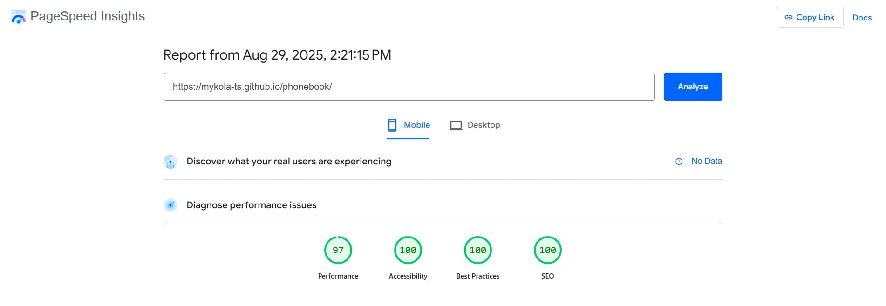

# 📔 Phonebook

Phonebook is a simple web application for managing contacts. It allows users to
easily add, search, edit, and delete phone numbers in a convenient interface,
making contact management fast and efficient.


## 📑 Table of Contents

- [About the Project](#-about-the-project)
- [Web App Structure](#-web-app-structure)
- [Useful Links](#-useful-links)
- [Technologies Used](#-technologies-used)
- [Libraries Used](#-libraries-used)
- [Folder and File Structure](#-folder-and-file-structure)
- [Features](#-features)
- [PageSpeed Results](#-pagespeed-results)
- [Installation & Setup](#-installation--setup)
- [Author](#-author)

## 📝 About the Project

This project is a responsive two-page web application developed as a Phonebook.
It allows users to create, edit, search, and manage contacts in a simple and
intuitive interface. The application provides a fast and convenient way to store
phone numbers, ensuring efficient contact management.

The app is built with React and modern JavaScript, featuring component-based
architecture and state management with Redux. It includes a responsive layout,
real-time search filtering, and local data storage for a smooth and
user-friendly experience across devices.


## 🧩 Web App Structure

## 🔗 Useful Links

- [Live Demo](https://mykola-ts.github.io/phonebook/) — deployed version of the
  web app

- [GitHub Repository](https://github.com/Mykola-Ts/phonebook) — source code of
  the project

## 🛠 Technologies Used

- HTML5
- CSS3
- JavaScript (ES6+)
- React
- Redux Toolkit — state management solution
- React Router DOM — routing and navigation
- Styled Components — CSS-in-JS styling
- Git / GitHub — version control and collaboration
- ESLint — code linting and style consistency

## 📦 Libraries Used

- [@reduxjs/toolkit](https://redux-toolkit.js.org/) — official, opinionated
  Redux wrapper with simplified API
- [react-redux](https://react-redux.js.org/) — React bindings for Redux
- [redux-persist](https://www.npmjs.com/package/redux-persist) — persist and
  rehydrate Redux store
- [react-router-dom](https://reactrouter.com/) — routing for React applications
- [axios](https://axios-http.com/) — promise-based HTTP client
- [formik](https://formik.org/) — form handling in React
- [yup](http://npmjs.com/package/yup) — schema validation for forms
- [lodash.throttle](https://lodash.com/docs/4.17.15#throttle) — utility to
  control function execution rate
- [react-hot-toast](https://react-hot-toast.com/) — beautiful notifications &
  toasts
- [react-icons](https://react-icons.github.io/react-icons/) — popular icon packs
  for React
- [react-loader-spinner](https://www.npmjs.com/package/react-loader-spinner) —
  loading spinners for React
- [react-modal](https://www.npmjs.com/package/react-modal) — accessible modal
  dialog component
- [react-select](https://react-select.com/home) — customizable select dropdowns
- [modern-normalize](https://github.com/sindresorhus/modern-normalize) —
  normalize default browser styles
- [styled-components](https://styled-components.com/) — CSS-in-JS styling
  library

## 📁 Folder and File Structure

- **.github/**: GitHub-specific configuration and workflows.

- **assets/**: Folder stores images used in the README.md file to visually
  document and represent the project.

- **public**: Contains static assets that are served directly without
  processing. Files inside are copied to the build folder as-is and can be
  accessed by their root path.

- **src/**: The main source folder of the React application. Contains all the
  code, components, assets, and logic of the project:

  - **components/**: Reusable UI components of the application (buttons, forms,
    modals, headers, etc.).

  - **fonts/**: Custom fonts used in the project.

  - **helpers/**: Utility functions or helper modules that provide reusable
    logic across the app.

  - **hooks/**: Custom React hooks that encapsulate logic for state, effects, or
    reusable patterns.

  - **img/**: Images and graphic assets used in the application.

  - **pages/**: Page-level components representing different views/routes of the
    app.

  - **redux/**: Redux state management logic, including slices, actions, and
    store configuration.

  - **index.js**: The main entry point of the React app. Renders the root
    component into the DOM (ReactDOM.createRoot).

- **.editorconfig**: Editor configuration file.

- **.gitignore**: Specifies which files and directories to ignore in Git.

- **.prettierrc.json**: Prettier configuration for code formatting.

- **jsconfig.json**: Configuration file for JavaScript/TypeScript in VS Code —
  defines compiler options, path aliases, and IntelliSense settings.

- **package.json**: Contains metadata about the project and dependencies.

- **README.md**: Project documentation and setup instructions.

- **uk_translation.yml**: Translation configuration file — specifies source
  files and where localized (e.g., Ukrainian) translations should be stored.

## 🎯 Features

- **Responsive Design** Web app adapts seamlessly to different screen sizes:
  desktop, tablet, and mobile devices, ensuring a smooth user experience on any
  device.

- **Mobile Menu** Slide-in mobile navigation menu and proper event handling. The
  menu closes when clicking the close button.

- **Keyboard Accessibility** Modal window and navigation elements are accessible
  via keyboard (e.g. Esc to close modals).

- **Clean & Modular Code** Code is split into logical modules.

- **Performance & Accessibility** The web app achieves high performance,
  accessibility, best practices, and SEO standards. Optimized code and structure
  ensure fast loading, smooth interactions, and an inclusive, user-friendly
  experience across all devices.

## 🚀 PageSpeed Results

Google's PageSpeed Insights was used to analyze the performance of the publicly
accessible page of the Phonebook web app on both mobile and desktop devices. The
results indicate strong performance in key areas, providing a smooth user
experience for public users.

- **📱 Mobile Performance:**



- **💻 Desktop Performance:**


These results reflect that the publicly available part of the web app is
optimized for fast loading times and high usability across devices.

## 🏗 Installation & Setup

To run the project locally, follow these steps:

1. **Clone the repository**

   ```bash
   git clone https://github.com/Mykola-Ts/phonebook.git
   cd phonebook
   ```

2. **Install dependencies**

   ```bash
    npm install
   ```

3. **Start the development server**

   ```bash
    npm start
   ```

4. **Open in browser**

Visit http://localhost:3000/phonebook to view the project.

## 👨‍💻 Author

**Mykola Tsybulskyi**

🔗 GitHub https://github.com/Mykola-Ts

🔗 Email tsybulskiyk@gmail.com

🔗 LinkedIn https://www.linkedin.com/in/mykola-tsybulskyi
